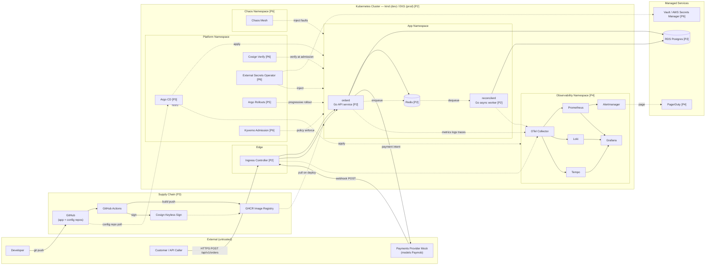

# Architecture

Target architecture for the self-healing platform demonstrated against the Go workload described in [ADR-006](adr/006-workload-go-shim.md), modeling the failure-mode classes from the Ahoy incident at the projected scale documented in [problem-statement.md](problem-statement.md) and [slos.md](slos.md). This is the **Phase 6 end state**; each piece is labelled with the phase that introduces it so the same diagram doubles as a roadmap.

## How to read this diagram

- **Subgraphs are boundaries**, not just groupings. Each subgraph border represents a change in trust, network, or authority.
- **Solid arrows** = synchronous request/response on the data path.
- **Dashed arrows** = asynchronous, control-plane, or telemetry flow.
- **`[Pn]` tags** = the phase that introduces this component.

## Diagram

## What each zone is for

- **External (untrusted).** Anything we don't run. All input crossing this boundary is hostile until validated. The payments-provider mock is "external" in the sense that the cluster treats its webhooks as third-party input — same trust model as a real provider.
- **Supply Chain.** Source code, build, image registry, and the signing step that makes the chain verifiable. Compromising any of these compromises everything downstream — admission-time verification ([P6]) closes that loop.
- **Edge.** TLS termination, ingress routing, and request normalization. Single entry point for both synchronous API traffic and incoming webhooks.
- **Platform Namespace.** Controllers that manage the cluster but don't serve customer traffic. Kept separate from app namespace so RBAC and NetworkPolicies can be tighter here.
- **App Namespace.** The Go workload — `orderd` (HTTP API) and `reconcilerd` (async worker) — purpose-built to exhibit the failure-mode classes from the Ahoy incident ([ADR-006](adr/006-workload-go-shim.md)). The only namespace where pulling code into production has direct revenue impact in the demo scenario.
- **Observability Namespace.** Telemetry sink for everything. Isolated so a chaos experiment on the app namespace can't take down the dashboards used to observe the experiment.
- **Chaos Namespace.** Separate so chaos resources are explicitly scoped and removable.
- **Managed Services.** RDS, Vault, PagerDuty — explicit "we don't run this" boundary. Failure modes and SLOs of these services bound everything inside the cluster.

## Tracing the SLO'd CUJs through the diagram

These traces are the consistency check between [slos.md](slos.md) and this diagram. If they ever stop tracing cleanly, one of the docs is wrong.

**CUJ-1: Order placement.** Customer → Ingress → `orderd` → (Redis for hold, RDS for persist, payments-provider mock for payment intent) → response back through the same path. p99 < 400ms, 99.5%, measured at Ingress.

**CUJ-2: Payment-webhook-to-ledger.** Payments-provider mock → Ingress → `orderd` (validates + enqueues) → Redis → `reconcilerd` → RDS (ledger commit). 99.9% within 60s, measured from Ingress receipt to RDS commit.

## Phase-by-phase build order

The same boxes, sorted by when they appear. This is the diagram an interviewer would ask you to walk if they wanted to test sequencing.

- **P2 (Walking Skeleton):** kind cluster, ingress, App Namespace (`orderd` first, then `reconcilerd` + the payments mock), Redis in-cluster, RDS external, one basic dashboard. *Goal: a request can reach a pod and a pod can reach RDS.*
- **P3 (Delivery Pipeline):** GitHub Actions, GHCR, Cosign signing, Argo CD with two-repo pattern, Trivy + gitleaks in CI. *Goal: merge-to-prod is automated and the artifact is signed.*
- **P4 (Observability):** OTel Collector, Prometheus, Loki, Tempo, Grafana, Alertmanager, PagerDuty wired up. Burn-rate alerts from `slos.md` go live here. *Goal: every SLO from slos.md has live measurement and live alerting.*
- **P5 (Reliability):** Argo Rollouts with automated analysis from Prometheus, PDBs, HPA, probes tuned, tested backup/restore with measured MTTR. *Goal: a bad deploy auto-rolls-back without human intervention.*
- **P6 (Security + Chaos):** Kyverno, Cosign verification at admission, External Secrets + Vault, NetworkPolicies default-deny, Chaos Mesh experiments tied to per-failure-mode postmortems. *Goal: a chaos experiment that breaks the system produces a paged alert and a known runbook.*

## Decisions deferred to ADRs

This diagram shows *what* is in the platform; it doesn't justify *why each pick over alternatives*. Those defenses live in `docs/adr/`:

- kind vs minikube vs k3d (local dev) — [ADR-001](adr/001-local-cluster-kind.md)
- Argo CD vs Flux (GitOps) — [ADR-002](adr/002-gitops-argo-cd.md)
- Cosign keyless vs key-based (signing) — [ADR-003](adr/003-image-signing-cosign-keyless.md)
- Kyverno vs OPA Gatekeeper (admission policy) — [ADR-004](adr/004-admission-policy-kyverno.md)
- Prometheus + Loki + Tempo vs a hosted alternative (observability stack) — [ADR-005](adr/005-observability-lgtm-self-hosted.md)
- Workload language and shape — Go shim modeling Ahoy failure modes — [ADR-006](adr/006-workload-go-shim.md)
- Argo Rollouts vs Flagger (progressive delivery) — deferred to Phase 5

## Non-goals for this diagram

- **No service mesh.** Per problem-statement non-goal #5, mTLS via cert-manager + NetworkPolicies covers the threat model at current service count.
- **No multi-region.** Per problem-statement non-goal #1, single MENA region is sufficient.
- **No multi-tenant isolation.** Per problem-statement non-goal #2, one trust boundary, namespace-level RBAC.
