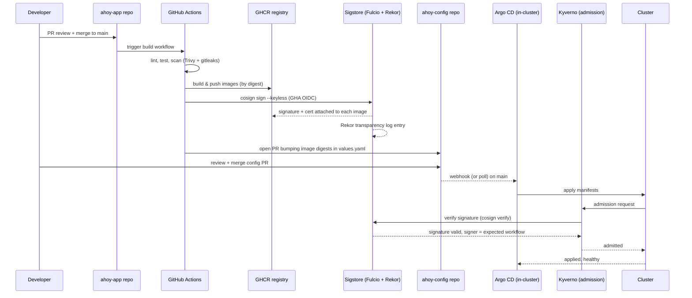

# Design — Self-Healing Kubernetes Platform

This is the integration document for the platform. Decisions live in [ADRs](adr/), threats live in [threat-model.md](threat-model.md), targets live in [slos.md](slos.md), boundaries live in [architecture.md](architecture.md). This document ties them together and fills the gaps the others don't cover: runtime interactions, failure modes, rollout plan, and open questions.

---

## 1. Context and goals

The platform codifies reliability practices motivated by operating Ahoy — a real MENA DTC + B2B sauce-and-condiment business currently running as a single-host application on AWS EC2 with CloudWatch-only observability. Ahoy is closed-source; the in-repo workload is a Go shim ([ADR-006](adr/006-workload-go-shim.md)) — `orderd` (HTTP API) and `reconcilerd` (async worker) — purpose-built to exhibit the same failure-mode classes the platform protects against. The numbers anchoring this design are the projection Ahoy was sizing for: ~25 engineers, six MENA cities, ~5k orders/day at peak, B2B onboarding underway. See [problem-statement.md](problem-statement.md) for the full context.

The triggering event is a real near-miss: a Paymob webhook backlog left ~200 orders in `PENDING` for 90 minutes during a flash promo. At 3× projected volume, that incident becomes a multi-hour revenue-and-refund event. The platform demonstrates the response to that class of failure against the Go workload, which exposes an analogous webhook → queue → ledger reconciliation path.

**Goals** (full list in [problem-statement.md §Success criteria](problem-statement.md#success-criteria); restated here for the reader):

1. **MTTR under 5 minutes** for service-level failures (baseline: 90+ minutes for the Paymob incident).
2. **99.5% availability and p99 < 400 ms** on the order-placement CUJ at projected peak ([slos.md CUJ-1](slos.md)).
3. **99.9% payment-webhook-to-ledger reconciliation within 60 seconds** ([slos.md CUJ-2](slos.md)).
4. **Self-service deploys under 10 minutes merge-to-production**, with automated rollback on SLO regression during progressive rollout.
5. **Reliability with proof** — chaos experiments, postmortems, and live SLO evidence as first-class deliverables, not retrofits.

## 2. Non-goals

Restated from [problem-statement.md §Non-goals](problem-statement.md#non-goals) so the design can refuse to drift:

- Multi-region active-active deployment (revisit at 50k orders/day).
- Multi-tenant cluster isolation (one product, one trust boundary).
- Operator-managed database (managed Postgres stays).
- Cost optimization as a primary goal (right-sizing is in scope; dedicated FinOps is not).
- Service mesh (mTLS via cert-manager + NetworkPolicies cover the threat model at the workload's service count).

## 3. Glossary

- **SLI** — Service Level Indicator. A measurable quantity (e.g., "fraction of `POST /api/v1/orders` returning 2xx in <400 ms").
- **SLO** — Service Level Objective. A target on an SLI over a window (e.g., 99.5% over 30 days).
- **Error budget** — `1 - SLO` × window. The amount of unavailability tolerated before the SLO is breached.
- **Burn rate** — How fast we are consuming error budget relative to the steady-state rate. 1× is "exactly on track"; 14.4× means a 30-day budget is consumed in ~2 days.
- **CUJ** — Critical User Journey. A user-facing flow with revenue impact, owned end-to-end by an SLO ([slos.md](slos.md) lists CUJ-1, CUJ-2).
- **MTTR** — Mean Time To Recovery. Wall-clock time from incident detection to service restoration.
- **Blast radius** — The maximum impact a single failure or compromise can have before containment.
- **PDB** — PodDisruptionBudget. A Kubernetes object ensuring a minimum number of replicas remain available during voluntary disruptions.
- **HPA** — Horizontal Pod Autoscaler. Scales replicas based on metrics.
- **GitOps** — Pull-based deployment model where Git is the source of truth and an in-cluster controller reconciles state ([ADR-002](adr/002-gitops-argo-cd.md)).
- **Admission control** — In-cluster policy enforcement intercepting every apply ([ADR-004](adr/004-admission-policy-kyverno.md)).
- **Progressive delivery** — Rollout strategy that gradually shifts traffic to a new version while comparing metrics; auto-rollback on regression.
- **Trust boundary** — A line in the architecture where authority, network, or code origin changes; the surface attacks land at ([threat-model.md](threat-model.md)).

## 4. Overview

The platform demonstrates a Kubernetes-native control plane against the Go workload from [ADR-006](adr/006-workload-go-shim.md), built in six iterative phases. The end state has three trust zones inside the cluster and explicit boundaries to managed services and to the supply chain.

See [architecture.md](architecture.md) for the full diagram. In summary:

- **Customer traffic** enters via an ingress controller terminating TLS in the cluster.
- **The app namespace** runs `orderd` (Go HTTP API), `reconcilerd` (Go async worker), and an in-cluster Redis. Postgres is managed (RDS in prod). A payments-provider mock — a small Go service modeling Paymob's HMAC/retry/timing behavior — also runs in this namespace for reproducible incident simulations.
- **A platform namespace** runs Argo CD (GitOps), Kyverno (admission), External Secrets (secret materialization from Vault), and Argo Rollouts (progressive delivery).
- **An observability namespace** runs Prometheus, Loki, Tempo, Grafana, Alertmanager, and an OpenTelemetry Collector.
- **A chaos namespace** runs Chaos Mesh in Phase 6.
- **Outside the cluster**, GitHub hosts the app and config repos; GitHub Actions builds and signs images via Cosign keyless ([ADR-003](adr/003-image-signing-cosign-keyless.md)); GHCR holds images; Vault holds secrets; PagerDuty pages on-call.

Two SLO'd Critical User Journeys (CUJs) trace through this end-to-end and serve as the consistency contract between [slos.md](slos.md), [architecture.md](architecture.md), and this document:

- **CUJ-1: Order placement.** Customer → Ingress → `orderd` → (Redis hold, RDS persist, payments-provider mock for payment intent) → response.
- **CUJ-2: Payment-webhook-to-ledger.** Payments-provider mock → Ingress → `orderd` webhook handler → Redis queue → `reconcilerd` → RDS ledger commit.

Every section below is anchored on enabling these two CUJs to meet their SLOs while closing the threat model.

## 5. Detailed design

### 5.1 Cluster topology

**Local (dev and CI):** kind cluster, 1 control-plane + 2 worker nodes, single config file (`kind-cluster.yaml`) used identically on a laptop and in GitHub Actions integration tests ([ADR-001](adr/001-local-cluster-kind.md)).

**Production:** AWS EKS, three availability zones in a single MENA region (matching the original business footprint per [problem-statement non-goal #1](problem-statement.md#non-goals)). Worker nodes in a managed node group sized for projected peak with headroom.

**Namespace layout:**

| Namespace | Purpose | NetworkPolicy default |
|---|---|---|
| `app` | Application workloads (`orderd`, `reconcilerd`, `payments-mock`, redis) | Deny ingress except from ingress namespace; deny egress except to RDS, payments-mock, S3, observability |
| `platform` | Argo CD, Kyverno, External Secrets, Argo Rollouts, cert-manager | Deny ingress except controller traffic |
| `observability` | Prometheus, Loki, Tempo, Grafana, OTel Collector, Alertmanager | Allow ingress from all namespaces (telemetry write path); deny egress to managed PagerDuty + S3 only |
| `ingress` | NGINX ingress controller (or Gateway API implementation) | Allow ingress from internet; egress to `app` namespace only |
| `chaos` | Chaos Mesh (Phase 6) | Restricted; can only affect labeled targets |

**Networking:** Cilium CNI for both pod networking and NetworkPolicy enforcement. Choice is preliminary and deferred to a Phase 2 sub-ADR — eBPF observability and Cilium NetworkPolicy supersets are attractive, but the simpler Calico option remains in play.

**Ingress:** NGINX Ingress Controller for Phase 2–4; migration to Gateway API evaluated in Phase 5 as it stabilizes.

### 5.2 Application layer

The application is the Go workload defined in [ADR-006](adr/006-workload-go-shim.md), packaged for Kubernetes:

| Workload | Replicas | Resources (initial) | Notes |
|---|---|---|---|
| `orderd` (Go API) | 3 (HPA 3–10) | 100m CPU / 128 Mi RAM request, 500m CPU / 256 Mi limit | Distroless static, non-root. Primary CUJ-1 + CUJ-2 entry path |
| `reconcilerd` (Go worker) | 2 (HPA 2–8) | 100m CPU / 128 Mi RAM request, 500m CPU / 256 Mi limit | Scales on Redis broker queue depth; carries CUJ-2 reconciliation |
| `payments-mock` (Go) | 1 | 50m CPU / 64 Mi RAM request, 200m CPU / 128 Mi limit | Models Paymob webhook timing and retry; used by chaos experiments |
| `redis` | 1 (StatefulSet) | 200m / 512 Mi req, 500m / 1 Gi limit | In-cluster; queue broker + cache |

**Packaging:** Each binary has its own Helm chart in the config repo (`/charts/<binary>`). Image digests are pinned in `values.yaml`; CI bumps the digests via PR.

**Configuration:** Non-secret config via ConfigMap (mounted as env or files). Secrets via External Secrets Operator (Phase 6) materializing Vault secrets into Kubernetes Secrets. Phase 2–5 use sealed envs in the config repo as an interim measure — non-ideal, called out as a Phase 6 transition target.

**Service exposure:** Each binary a ClusterIP Service; the ingress controller routes by host + path. Internal service-to-service calls use the cluster DNS name; TLS between ingress and pods is plaintext in Phase 2 (NetworkPolicies + node-local trust), with cert-manager-issued in-cluster TLS landing in Phase 6 ([threat-model.md §B2:T](threat-model.md)).

### 5.3 Delivery pipeline (CI + GitOps)

This is the mechanism that closes [threat-model.md §B8](threat-model.md) — the supply chain.

**Two repositories** ([ADR-002](adr/002-gitops-argo-cd.md)):

- **`ahoy-app`** — Go workload source (`orderd`, `reconcilerd`, `payments-mock`), Dockerfiles per binary, GHA workflows.
- **`ahoy-config`** — Kubernetes manifests, Helm charts, Helm values, Argo CD `Application` + `AppProject` definitions, Kyverno `ClusterPolicy` resources.

**Pipeline flow:**



**Sync wave order in Argo CD** ([ADR-004 chicken-and-egg](adr/004-admission-policy-kyverno.md#consequences)):

- Wave `-10`: Kyverno controller + CRDs.
- Wave `-5`: ClusterPolicies (`verifyImages`, `disallow-privileged`, etc.).
- Wave `0`: Workload manifests.

**Break-glass deploy** (when Argo CD or sigstore is unavailable, per [threat-model.md §B8:D](threat-model.md) and [ADR-003 follow-up](adr/003-image-signing-cosign-keyless.md#follow-up-work-this-commits-us-to)):

- Documented `kubectl apply` procedure with a known image digest.
- Kyverno can be temporarily disabled per-namespace with audit-logged approval; the disable is a Git commit so the audit trail survives.
- Sigstore outage fallback: ephemeral signing key, time-boxed, post-incident attested.

### 5.4 Observability stack

The mechanism that makes the SLOs in [slos.md](slos.md) measurable, alertable, and debuggable.

**Intake:** OpenTelemetry Collector deployed as a DaemonSet (per-node receivers for app-local sidecar/agent traffic) plus a Deployment (gateway for ingress-side collection and processing). Apps emit OTLP. The collector applies a **PII scrubber** ([ADR-005 follow-up](adr/005-observability-lgtm-self-hosted.md#follow-up-work-this-commits-us-to), closing [threat-model.md §B5:I](threat-model.md)) — explicit deny-list for fields the Go workload may touch: `customer_email`, `customer_phone`, `delivery_address`, `payment_card_last4` (the PII surface from [threat-model.md §A1](threat-model.md)).

**Routing:**

- Metrics → Prometheus (single instance, sufficient at projected scale per [ADR-005](adr/005-observability-lgtm-self-hosted.md)).
- Logs → Loki (object-store backend on S3-compatible storage).
- Traces → Tempo (object-store backend, head-based sampling at 10%).

**SLO measurement** ([slos.md](slos.md)):

- **CUJ-1 availability** — Prometheus recording rule:

  ```
  cuj1:order_placement:availability:ratio_5m =
    sum(rate(ingress_requests_total{path="/api/v1/orders", method="POST", status=~"2.."}[5m]))
    /
    sum(rate(ingress_requests_total{path="/api/v1/orders", method="POST", status!~"4.."}[5m]))
  ```

- **CUJ-1 latency** — `histogram_quantile(0.99, sum by (le) (rate(ingress_request_duration_seconds_bucket{path="/api/v1/orders",method="POST"}[5m])))`.

- **CUJ-2 timeliness** — application-emitted `webhook_to_ledger_seconds` histogram, recorded inside `reconcilerd` at the moment the DB transaction commits. `histogram_quantile(0.999, ...) < 60` is the SLO.

**Burn-rate alerts** — pair of recording rules per CUJ (1h + 6h windows for the page rule; 6h + 24h for the ticket rule). Multi-window pattern per [slos.md §Alerting policy](slos.md#alerting-policy). Alertmanager routes pages via PagerDuty; tickets to the backend team queue.

**Trace correlation:** every log line includes `trace_id` and `span_id` (OTel-Go SDK + zerolog enrichment). Grafana's "logs to traces" feature gives one-click correlation from an alert to the offending request.

**Retention:** 30 days metrics, 14 days logs hot + 90 cold, 7 days traces hot + 30 cold ([ADR-005](adr/005-observability-lgtm-self-hosted.md)).

### 5.5 Reliability mechanisms

The mechanisms that take "MTTR under 5 minutes" from a goal to a property of the system.

**Probes (every workload):**

- **Liveness** — restart pod if app process is stuck. Endpoint: `/healthz` (process up, no dependency check).
- **Readiness** — remove from Service endpoints if dependency unhealthy. Endpoint: `/readyz` (checks DB connection pool, Redis broker, can-reach payments-mock if applicable).
- **Startup** — give slow-starting workloads time before liveness kicks in. Same `/healthz`, longer threshold.

**HPA:**

- `orderd`: CPU 70%, min 3 / max 10.
- `reconcilerd`: **custom metric** — Redis broker queue depth — min 2 / max 8. Closes [threat-model.md §B2:D](threat-model.md) (queue depth explosion under webhook flood).

**PDBs:** every workload has a PDB with `minAvailable: 1` (single-replica safety) or `maxUnavailable: 1` (multi-replica). Argo Rollouts respects PDBs; node drains respect PDBs; chaos experiments respect PDBs.

**Argo Rollouts (Phase 5):**

- Canary strategy: 10% → analysis → 25% → analysis → 50% → analysis → 100%.
- Analysis queries Prometheus for the CUJ SLO indicators. Specifically: error rate on `POST /api/v1/orders`, p99 latency, and `webhook_to_ledger_seconds` p99.9. Any regression beyond the SLO threshold during the canary window → automated rollback.
- Rollout is the **only** way workload images change in production. Direct manifest edits trigger Argo CD drift correction.

**Graceful shutdown.** Both `orderd` and `reconcilerd` trap SIGTERM, stop accepting new work, drain in-flight requests/messages, close DB and broker pools, then exit. Helm template adds a `preStop` sleep of ~8s so endpoint-removal propagation precedes drain — closes the deploy-time error blip that conflated endpoint-update timing with shutdown ordering.

**Backup and restore:**

- **RDS Postgres** — RDS automated backup (30-day retention) + manual pre-deploy snapshot. Snapshot restoration is rehearsed quarterly; the runbook is committed to the config repo.
- **Cluster state** — Argo CD's source of truth is Git. A torched cluster is reproducible by `kubectl apply -k bootstrap/` → Argo CD takes over.
- **Object stores** (Loki, Tempo chunks) — S3 with versioning; cold deletion is lifecycle-driven.

**Disaster recovery targets** (open questions, see §9):

- **RTO** target: 60 minutes for cluster-level disaster (including infra rebuild).
- **RPO** target: 5 minutes for app data (matches RDS continuous backup granularity).
- Failover region not in scope per [non-goal #1](problem-statement.md#non-goals); DR means rebuild in the same region.

### 5.6 Security posture

This section ties together [ADR-003](adr/003-image-signing-cosign-keyless.md), [ADR-004](adr/004-admission-policy-kyverno.md), and the residual-risk mitigations across [threat-model.md](threat-model.md).

**Image supply chain:**

- Every image (`orderd`, `reconcilerd`, `payments-mock`) signed at build time by Cosign keyless (GHA OIDC).
- Verified at admission time by Kyverno `verifyImages` matching the expected OIDC issuer + subject pattern (`https://github.com/<org>/ahoy-app/.github/workflows/build.yml@refs/heads/main`).
- Image references in manifests are by **digest only** — Kyverno `require-image-digest-not-tag` policy refuses tags.

**Admission policies** — the catalog from [ADR-004 §Initial policy catalog](adr/004-admission-policy-kyverno.md#initial-policy-catalog). Highlights:

- `verify-images-cosign` — image signature mandatory.
- `disallow-paymob-log-mode-in-prod` — closes top-risk #1; refuses pods carrying `PAYMENTS_PROVIDER_MODE=log` outside dev namespaces. The `orderd` workload exposes this env knob deliberately ([ADR-006](adr/006-workload-go-shim.md)) so the policy has a real footgun to refuse.
- `disallow-privileged-containers`, `disallow-host-namespaces`, `disallow-hostpath-volumes` — close [threat-model.md §B8:E](threat-model.md) lateral-movement vectors.
- `require-non-root`, `require-resource-limits`, `require-network-policy-per-namespace`.

**Secrets** (Phase 6):

- External Secrets Operator + Vault (managed AWS Secrets Manager as an interim Vault substitute is acceptable if Vault deployment is deferred).
- Short-lived rotation: 24-hour rotation on `PAYMENTS_PROVIDER_HMAC_SECRET` and the workload's JWT signing secret ([threat-model.md §A6](threat-model.md)).
- No long-lived AWS keys in CI ([threat-model.md §B8:I, §B8:E](threat-model.md)) — OIDC trust only.

**Network:**

- Default-deny NetworkPolicies in every namespace.
- Explicit allow-lists per namespace (see §5.1 table).
- cert-manager-issued in-cluster TLS for service-to-service (Phase 6) — closes [threat-model.md §B2:T](threat-model.md).

**RBAC:**

- Per-namespace ServiceAccounts. `orderd` and `reconcilerd` do not need cluster-API access and set `automountServiceAccountToken: false`.
- Argo CD `AppProject` scoping per app team (currently one team, but the structure stands ready).
- No `cluster-admin` bindings except for Argo CD's own controller (least-privilege within target namespaces).

**Audit:**

- GHA audit logs exported to S3 Object Lock ([threat-model.md §B2:R, §B8:R](threat-model.md)).
- Argo CD sync history retained beyond default rotation, exported to Loki for queryability.
- Kyverno ClusterPolicyReports written to a long-retention namespace.
- Append-only webhook audit table written by `orderd` ([threat-model.md §B2:R](threat-model.md)).

### 5.7 Failure handling and self-healing

The marquee section for a "self-healing" platform. What heals automatically, what requires human intervention, and the boundary between them.

**Self-healing — no human action required:**

| Failure | Detection | Automatic response |
|---|---|---|
| Pod stuck (liveness fail) | Liveness probe | kubelet restarts the pod |
| Pod dependency unhealthy | Readiness probe | Pod removed from Service endpoints; traffic routes elsewhere |
| Traffic spike on `POST /api/v1/orders` | CPU > 70% on `orderd` pods | HPA scales up (3 → 10 replicas) |
| Webhook queue backlog | Broker queue depth metric | HPA scales `reconcilerd` (2 → 8) |
| Bad deploy regresses SLO | Argo Rollouts analysis query to Prometheus | Auto-rollback to previous ReplicaSet |
| Drift in cluster (manual edit) | Argo CD sync loop | Revert to Git state (or alert, per syncPolicy) |
| Worker node failure | Node controller | Pods rescheduled to surviving nodes (PDBs honored) |
| Single-AZ disruption | Multi-AZ EKS managed node group | Pods rescheduled to AZs still up |

**Human in the loop — alerts to runbook:**

| Failure | Detection | Alert tier | Runbook |
|---|---|---|---|
| CUJ-1 fast-burn (14.4× over 1h + 6× over 6h) | Multi-window burn-rate alert | **Page** | runbooks/cuj1-order-placement.md |
| CUJ-2 fast-burn | Same pattern | **Page** | runbooks/cuj2-webhook-reconciliation.md ([slos.md §Alerting policy](slos.md#alerting-policy)) |
| CUJ slow-burn (6× over 6h + 1× over 24h) | Multi-window | Ticket | Same runbook, business-hours |
| RDS failover | RDS event + readiness probe spike | **Page** | runbooks/rds-failover.md |
| Argo CD unhealthy | Self-monitor | Ticket | runbooks/argo-cd-unhealthy.md (drift continues uncorrected) |
| Kyverno controller down | Self-monitor | Ticket | runbooks/kyverno-down.md (admission may fail open or closed depending on `failurePolicy`) |
| Sigstore down (Fulcio or Rekor) | CI sign step fails | Ticket | runbooks/sigstore-outage.md (break-glass per [ADR-003](adr/003-image-signing-cosign-keyless.md)) |
| Image vulnerability scan finding (HIGH/CRITICAL) | GHCR scan + nightly job | Ticket | runbooks/cve-response.md |
| Drift in ledger (DB write outside app) | Reconciliation job (Phase 5 backend work) | **Page** | runbooks/ledger-drift.md ([threat-model.md §A3](threat-model.md)) |
| Certificate expiry warning (<7 days) | cert-manager metric | Ticket | runbooks/cert-renewal.md |

**Chaos experiments (Phase 6):**

For each row in the "self-healing" table, a Chaos Mesh experiment verifies the response actually happens within the MTTR target (5 minutes). Experiments run on a schedule in staging; production experiments are opt-in per-team and require an approved Application annotation. Each experiment produces a postmortem-style report in the config repo.

### 5.8 Data layer

**Postgres (RDS):**

- Engine: PostgreSQL 16. Aurora vs single-instance RDS deferred to a Phase 2 ADR — Aurora gives continuous backup and faster failover but at higher cost. Single-instance Multi-AZ with read replica is the conservative default.
- Connection pooling: pgx pool inside `orderd` and `reconcilerd` is the first line; PgBouncer as a sidecar or DaemonSet is a deferred decision (see §9 open questions). The fidelity contract in [ADR-006](adr/006-workload-go-shim.md) requires the pool's `MaxConns`/`MinConns`/`MaxConnIdleTime` to be env-tunable so chaos experiments can reproduce pool starvation.
- Backups: RDS automated, 30-day retention. Plus a pre-deploy manual snapshot pattern.
- **Role separation** — closes [threat-model.md §A3, §B6](threat-model.md): app role has `INSERT/SELECT/UPDATE` on the workload's tables but **no `DELETE`/`TRUNCATE` on `ledger_entries`**; admin role separately managed with break-glass auditing. DB-level append-only enforcement via trigger on the ledger table.
- Migration: golang-migrate, run by the Argo CD pre-sync hook (single execution per deploy).

**Redis (in-cluster):**

- StatefulSet with persistent volume.
- Single replica with periodic snapshot for now. ElastiCache migration is an option if cluster-resident state becomes an availability blocker (open question §9).
- Used as `reconcilerd`'s broker and as the cache-aside for order lookup; both uses are tolerant to short outages (worker retries; cache falls back to DB-only reads).

**Object storage:**

- S3 for Loki chunks, Tempo blocks, audit-log export (Object Lock for the latter per [threat-model.md §B2:R, §B8:R](threat-model.md)), and pre-deploy DB snapshots.

## 6. Alternatives considered

The major decisions live in their own ADRs; this section is a brief index. Each ADR has its own alternatives-considered section with full reasoning.

| Decision | Chose | Alternatives | ADR |
|---|---|---|---|
| Local cluster | kind | minikube, k3d, k3s, Docker Desktop, microk8s | [ADR-001](adr/001-local-cluster-kind.md) |
| GitOps controller | Argo CD | Flux v2, push-based CI deploy, manual kubectl | [ADR-002](adr/002-gitops-argo-cd.md) |
| Image signing | Cosign keyless | Cosign with KMS keys, Notary v2, Docker Content Trust, no signing | [ADR-003](adr/003-image-signing-cosign-keyless.md) |
| Admission policy | Kyverno | OPA Gatekeeper, native CEL VAP, jsPolicy/Polaris, no admission | [ADR-004](adr/004-admission-policy-kyverno.md) |
| Observability | Self-hosted LGTM | Datadog, Honeycomb, Grafana Cloud, CloudWatch+X-Ray, Mimir | [ADR-005](adr/005-observability-lgtm-self-hosted.md) |
| Workload | Go shim (orderd + reconcilerd) modeling Ahoy failure modes | Anonymized Ahoy fork, generic Go e-commerce sample, Python stand-in, three-service split | [ADR-006](adr/006-workload-go-shim.md) |

Decisions **not yet ADR'd** but tracked for Phase 2–6 (see §9 open questions): CNI (Cilium vs Calico), progressive delivery controller (Argo Rollouts is implied by [ADR-002](adr/002-gitops-argo-cd.md) but not separately defended), secret management timing (External Secrets + Vault Phase 6 vs sealed secrets interim), Aurora vs RDS, PgBouncer placement, Redis (in-cluster vs ElastiCache).

## 7. Trade-offs

What this design explicitly gives up.

- **Operational burden on the platform team.** Self-hosted LGTM, self-hosted Vault, self-hosted everything except RDS. A SaaS-heavy design would be faster to stand up and operate. We accept the burden in exchange for cost control and skill-transfer ([ADR-005](adr/005-observability-lgtm-self-hosted.md)).
- **Argo + Kyverno + Cosign chain is more controllers than a minimal cluster.** Each controller is a failure mode of its own (`Kyverno down → admission failures`, `Argo CD down → no deploys`). Each controller earns its place via threat-model traceability, but the overall complexity is real.
- **Two-repo pattern doubles PRs per change.** Every image bump is a PR in `ahoy-app` (build) plus a PR in `ahoy-config` (deploy). We accept the friction in exchange for break-glass capability and decoupled rollback ([ADR-002](adr/002-gitops-argo-cd.md)).
- **Sigstore SaaS dependency.** Sign-time availability requires Fulcio + Rekor. Break-glass procedures exist but represent operational risk ([ADR-003 negative consequences](adr/003-image-signing-cosign-keyless.md#consequences)).
- **No multi-region failover.** A regional AWS event takes the workload down. The non-goal is deliberate at this scale ([problem-statement non-goal #1](problem-statement.md#non-goals)).
- **PII risk in telemetry intake.** OTel Collector's PII scrubber is allow-list-based on fields we know exist; novel PII added to the workload emits to telemetry unless the scrubber is updated. Mitigated by code-review discipline and periodic audit, not architecturally closed.
- **Argo CD's own privilege.** Argo CD writes to every namespace it owns; its compromise = control of those namespaces. Namespace-scoped Projects + Kyverno bound the blast radius but do not eliminate it ([threat-model.md §B9](threat-model.md)).
- **Workload fidelity ceiling.** The Go shim ([ADR-006](adr/006-workload-go-shim.md)) reproduces Ahoy's failure-mode classes, not Ahoy's product depth. Some failure modes that would manifest only at real product complexity (e.g., FIFO inventory contention under multi-warehouse race conditions) are out of scope; the platform's claims are bounded by what the shim exhibits.

## 8. Failure modes

Enumerated. Each row gives detection, response, and blast radius. This is the table the on-call engineer reads during an incident; precision matters.

| # | Failure | Detection | Response | Blast radius |
|---|---|---|---|---|
| 1 | `orderd` pod crash | Liveness probe fail | kubelet restart; HPA may add replica if sustained | Single pod; no user impact if N≥2 |
| 2 | `orderd` dependency unhealthy (RDS unreachable) | Readiness probe fail | Pod removed from Service; HPA cannot help; CUJ-1 starts burning budget | All `POST /api/v1/orders` 5xx until RDS returns |
| 3 | Worker node failure | Node controller | Pods rescheduled across surviving nodes (PDBs honored) | Up to ~30s of disrupted requests on rescheduled pods |
| 4 | Single-AZ disruption | AWS event + node controller | Multi-AZ scheduling rebalances | Possibly elevated latency during rebalance; no full outage |
| 5 | RDS failover (Multi-AZ) | AWS event + connection failure | Pods reconnect via DNS; ~30–60s of `POST /api/v1/orders` errors | CUJ-1 ~30–60s burn |
| 6 | Payments provider outage | Outbound 5xx from `orderd`'s payments-mock client | `orderd` returns explicit 502 with retry guidance; orders queue in `AWAITING_PAYMENT` | CUJ-1 affected only for instant-payment orders; CUJ-2 stalls until provider returns |
| 7 | Webhook flood ([threat-model.md §B2:D](threat-model.md)) | Ingress rate-limit metric spike; broker queue depth alarm | Ingress rate-limit clamps; `reconcilerd` HPA scales up; circuit-breaker on handler returns 503 → provider retries | CUJ-2 burn during ramp |
| 8 | Forged payments webhook (HMAC compromise, [threat-model.md §B2:S](threat-model.md)) | Out-of-band reconciliation job detects mismatch | Manual investigation; admin disables ingress to webhook endpoint; rotate secret | Financial — bounded by reconciliation interval |
| 9 | Ledger drift (DB write outside app, [threat-model.md §A3](threat-model.md)) | Nightly reconciliation job vs provider settlement report | **Page** + freeze ledger writes pending investigation | Financial; integrity-of-record question |
| 10 | Argo CD unhealthy | Argo CD self-monitor metrics | Restart controller; drift continues uncorrected until restored; break-glass `kubectl apply` for urgent fixes | No new deploys; existing workloads keep running |
| 11 | Kyverno controller down | Kyverno self-monitor | If `failurePolicy: Fail` — admissions reject (safer); if `Ignore` — admissions pass (riskier). Choose `Fail` for `verify-images-cosign` | Cannot deploy until Kyverno returns |
| 12 | Sigstore down (Fulcio/Rekor) | CI cosign sign step fails | Break-glass: ephemeral key sign, post-incident attestation; deploys queued in `ahoy-config` until restored | No new image deploys; existing pods unaffected |
| 13 | GitHub unavailable | CI fails; Argo CD repo poll fails | No deploys until restored; running workloads unaffected | Deploy capability lost |
| 14 | GHCR unavailable | Image pull errors on new pods | kubelet image cache serves existing pods; new pods fail until GHCR returns | New scale-up blocked |
| 15 | Bad deploy (regresses SLO) | Argo Rollouts analysis | Auto-rollback to previous ReplicaSet within canary window | Limited to canary percentage (10%) before rollback |
| 16 | Certificate expiry (cert-manager fails to renew) | cert-manager metric; alert at <7 days | Manual rotation; runbook documented | TLS errors when cert expires |
| 17 | Secret rotation lag (Vault/External Secrets) | External Secrets metric | Manual re-sync; app restart picks up new secret | Stale secret in use until rotation completes |
| 18 | Cluster-wide event (control plane down) | EKS health event | EKS managed control plane recovers; workloads run on data plane | No new pods scheduled; existing pods unaffected |
| 19 | Chaos experiment escapes scope | Experiment self-monitor + cluster health | Chaos Mesh kill-switch; runbook | Per experiment design; PDBs limit blast radius |
| 20 | Observability stack down (Prom/Loki/Tempo) | External heartbeat; Alertmanager dead-man's switch | **Page** — we cannot measure SLOs while telemetry is dark | No data collection; alert routing if Alertmanager survives |

## 9. Risks and open questions

Honest list of what is not yet decided or known.

1. **CNI: Cilium vs Calico.** Cilium offers eBPF observability and richer NetworkPolicy semantics but is more complex. Calico is the conservative pick. Decide in Phase 2 with a sub-ADR; default is Cilium pending a proof of concept on kind.
2. **Aurora vs RDS single-instance Multi-AZ.** Cost vs RPO/RTO tradeoff. Need a number on the cost delta and a measured RTO from each. Decide before Phase 2 RDS provisioning.
3. **Vault deployment vs AWS Secrets Manager as interim.** Self-hosted Vault is operational burden in Phase 6; AWS Secrets Manager via External Secrets is simpler. Question: does the threat model justify the Vault upgrade, or is ASM sufficient?
4. **PgBouncer placement.** Sidecar (per-binary) gives connection pooling closest to the workload but multiplies pooler count; cluster-wide DaemonSet centralizes but adds a hop. The fidelity contract requires pool-starvation reproducibility — measure with pgx pool alone first, add PgBouncer only if its placement materially changes the failure shape.
5. **Redis: in-cluster vs ElastiCache.** In-cluster matches the platform-native ethos; ElastiCache offloads operational concerns. Question: is in-cluster Redis a real availability liability for CUJ-2?
6. **Default `failurePolicy` for Kyverno admission webhooks.** `Fail` (refuse on Kyverno outage — safer) vs `Ignore` (allow on outage — keeps deploys flowing). Trade-off between availability and security; needs explicit per-policy decision.
7. **Sigstore self-hosted vs SaaS.** SaaS is fine at this scale; self-hosted Rekor would close the public-log concern but adds significant operational burden. Decide if/when public-log visibility becomes a real concern.
8. **DR target numbers (RTO/RPO).** Drafted as RTO 60min / RPO 5min, but neither is grounded in measurement. Phase 5 DR rehearsal will produce real numbers.
9. **Out-of-band payments-provider reconciliation job cadence.** Hourly? Daily? Real-time stream? Trades off detection lag against API quota. Needs the provider's API documentation review.
10. **Per-team `AppProject` scoping in Argo CD.** Phase 1 has one team; the structure should be ready for multi-team but the specifics (project boundaries, sync windows, RBAC) are deferred.
11. **Chaos experiment cadence and scope in production.** How often, against what targets, with what bound on production impact. Phase 6 design.
12. **Cost model.** No back-of-envelope total for the platform. Should produce one before Phase 2 starts to confirm the project is bounded by single-developer compute (i.e., laptop + ~$200/month of staging AWS) rather than runaway.

## 10. Rollout plan

The platform builds in six phases. Phase 1 (paper artifacts) is concluding with this document; Phases 2–6 are the build.

Each phase produces a specific set of deliverables and **must clear an exit checkpoint** before the next phase begins. Phase exit is gated on demonstrable behavior, not on document existence — the CV-piece thesis is "reliability with proof," not "reliability with paperwork."

### Phase 2 — Walking Skeleton

**Goal:** a single request can reach a pod and that pod can reach RDS. The minimum cluster that proves the topology works.

**Deliverables:**
- kind cluster spinning up via `make cluster-up` ([ADR-001](adr/001-local-cluster-kind.md)).
- One namespace (`app`), `orderd` deployed, one Service, one Ingress.
- RDS provisioned (staging instance, single AZ to start).
- Postgres connection working from the pod.
- One Prometheus instance with a single `up` dashboard in Grafana.
- A Helm chart for `orderd`, in a config repo (`ahoy-config`).
- GitHub Actions workflow that builds and pushes the image (unsigned, for now).
- `reconcilerd` + payments-mock follow once the API path is green.

**Exit checkpoint:** `curl https://staging.platform.example/api/v1/orders` reaches `orderd`, returns 200, and the underlying request shows up in Grafana within 30 seconds.

### Phase 3 — Delivery Pipeline

**Goal:** merge-to-prod is automated, signed, and verifiable.

**Deliverables:**
- Argo CD installed; the `ahoy-config` repo is its source of truth ([ADR-002](adr/002-gitops-argo-cd.md)).
- Two-repo pattern wired: CI in `ahoy-app` opens a PR in `ahoy-config` bumping image digests.
- Cosign keyless signing added to the CI workflow ([ADR-003](adr/003-image-signing-cosign-keyless.md)).
- Trivy + gitleaks in CI.
- Kyverno installed with `verify-images-cosign` policy and the rest of the catalog ([ADR-004](adr/004-admission-policy-kyverno.md)).
- Sync waves configured so Kyverno is up before any workload.
- `reconcilerd` and payments-mock workloads added.

**Exit checkpoint:** a merge to `main` in `ahoy-app` produces a deployed image in staging within 10 minutes, attributable to the specific commit, verifiably signed by the expected workflow. An attempt to apply an unsigned image manifest is rejected by admission.

### Phase 4 — Observability

**Goal:** every SLO in [slos.md](slos.md) has live measurement and live alerting.

**Deliverables:**
- LGTM stack deployed ([ADR-005](adr/005-observability-lgtm-self-hosted.md)).
- OpenTelemetry Collector with PII scrubber.
- Ingress instrumented to emit per-request metrics.
- `orderd` and `reconcilerd` emit traces with `trace_id` in logs.
- Prometheus recording rules for CUJ-1 + CUJ-2 SLOs.
- Burn-rate alerts wired to Alertmanager → PagerDuty.
- Grafana dashboards: SLO overview, CUJ-1 detail, CUJ-2 detail, cluster health, supply-chain health (Kyverno admit/reject, Argo CD sync status).
- Runbook templates committed to `ahoy-config/runbooks/`.

**Exit checkpoint:** inject a synthetic 5xx error on the order endpoint at 5% for 10 minutes. The fast-burn alert fires within the alerting window, the page reaches PagerDuty, and the runbook link works.

### Phase 5 — Reliability

**Goal:** a bad deploy auto-rolls-back without human intervention; a tested DR procedure exists.

**Deliverables:**
- Probes tuned across all workloads.
- HPA configured (CPU for `orderd`; broker-depth custom metric for `reconcilerd`).
- PDBs on every workload.
- Argo Rollouts with canary strategy and Prometheus-backed analysis.
- Tested backup/restore for RDS with measured MTTR.
- Cluster bootstrap script (`bootstrap/`) reproducing the platform on a fresh cluster.
- DR rehearsal: tear down a staging cluster, rebuild from Git, measure recovery time.

**Exit checkpoint:** a deliberately bad deploy (regressing CUJ-1 latency past SLO) is auto-rolled-back within the canary analysis window. The DR rehearsal hits the RTO target (or honestly resets the target based on measurement).

### Phase 6 — Security and Chaos

**Goal:** a chaos experiment that breaks the system produces a paged alert and the on-call engineer has a runbook that works.

**Deliverables:**
- Default-deny NetworkPolicies across all namespaces ([threat-model.md §B2:T, §B3](threat-model.md)).
- cert-manager + in-cluster TLS for service-to-service.
- External Secrets Operator + Vault (or AWS Secrets Manager via External Secrets, pending §9 open question 3).
- Chaos Mesh deployed; one experiment per "self-healing" row in §5.7's first table.
- Audit-log export to S3 Object Lock ([threat-model.md §B2:R, §B8:R](threat-model.md)).
- Per-failure-mode postmortems produced from the chaos experiments.

**Exit checkpoint:** a Chaos Mesh experiment kills the primary `orderd` pod during peak-load simulation. The system recovers within the MTTR target with no human intervention beyond the runbook check. The experiment's postmortem is committed.

---

## References

- [problem-statement.md](problem-statement.md)
- [slos.md](slos.md)
- [architecture.md](architecture.md)
- [threat-model.md](threat-model.md)
- [adr/001-local-cluster-kind.md](adr/001-local-cluster-kind.md)
- [adr/002-gitops-argo-cd.md](adr/002-gitops-argo-cd.md)
- [adr/003-image-signing-cosign-keyless.md](adr/003-image-signing-cosign-keyless.md)
- [adr/004-admission-policy-kyverno.md](adr/004-admission-policy-kyverno.md)
- [adr/005-observability-lgtm-self-hosted.md](adr/005-observability-lgtm-self-hosted.md)
- [adr/006-workload-go-shim.md](adr/006-workload-go-shim.md)
